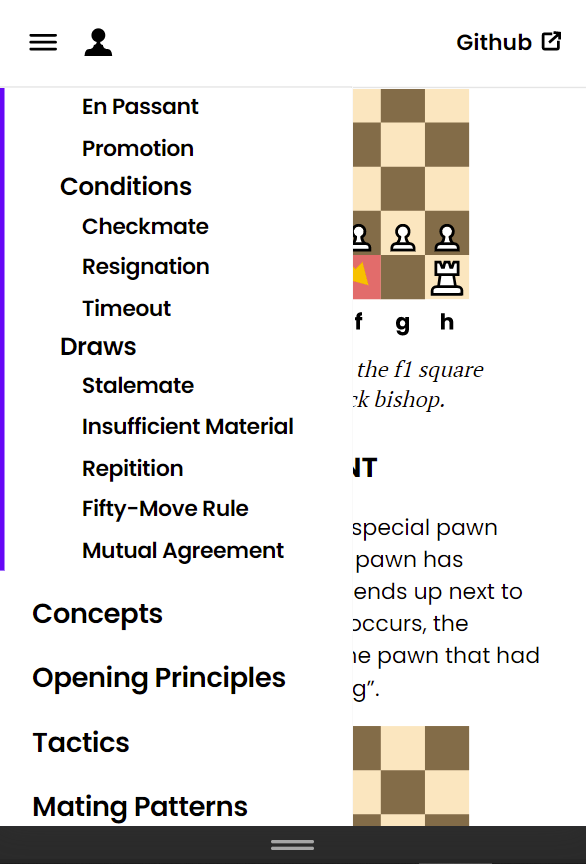
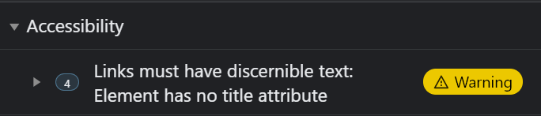

# Testing

## Contents

- [Code Validation](#code-validation)
- [User Story Testing](#user-story-testing)
- [Manual Testing](#manual-testing)
- [Bug Fixes](#bug-fixes)
- [Unintended Behaviour / Considerations](#unintended-behaviour-considerations)

## Code Validation

All HTML code was validated through the [W3C Markup Validator](https://validator.w3.org/) with all errors and warnings resolved.

***Validated 03/06/21***

- [index.html](index.html) - No errors/warnings
- [setup.html](setup.html) - [Errors/Warnings](assets/img/testing/setup-html-validation.png) - Fixed
- [rules.html](rules.html) - [Errors/Warnings](assets/img/testing/rules-html-validation.png) - Fixed
- [concepts.html](concepts.html) - [Errors/Warnings](assets/img/testing/concepts-html-validation.png) - Fixed
- [opening-principles.html](opening-principles.html) - [Errors/Warnings](assets/img/testing/opening-principles-html-validation.png) - Fixed
- [tactics.html](tactics.html) - [Errors/Warnings](assets/img/testing/tactics-html-validation.png) - Fixed
- [mating-patterns.html](mating-patterns.html) - [Errors/Warnings](assets/img/testing/tactics-html-validation.png) - Fixed
- [about.html](about.html) - [Errors/Warnings](assets/img/testing/about-html-validation.png) - Fixed

All CSS code was validated through the [W3C CSS Validator](https://jigsaw.w3.org/css-validator/) and returned with no errors or warnings.

***Validated 03/06/21***

- [styles.css](assets/css/styles.css) - No errors/warnings

## User Story Testing

### User Story 1

As a new visitor to the site, I want to be able to get started quickly and be able to reference certain sections whenever I need to.

#### Tests

- Users are able to navigate via the sidebar to any page on the site from any page.
- Users are able to quickly navigate from section to section via the subheader links in the sidebar.
- Users are led through a natural progression of chess rules and concepts via the page links at the end of each page.

### User Story 2

As a new visitor to the site, I want to be able to use the site on my phone/tablet to quickly refer to when playing a chess game.

#### Tests

- The site was tested on multiple device viewports using 3rd party services, device emulation via the web inspector on Microsoft Edge And Mozilla Firefox Developer Edition and personal devices.

3rd party sites used:

- [Google Mobile Friendly Test](https://search.google.com/test/mobile-friendly) - Passed
- [Website Responsive Test](https://websiteresponsivetest.com/) - All devices tested

### User Story 3

As a new visitor to the site and a chess beginner, I want to be able to see illustrations and examples as opposed to heavy verbose articles.

#### Tests

- All SVG illustrations load successfully and are displayed with the correct dimensions.
- All images have alt text for accessbility and all figures that need captions have been correctly structured.
- All figures and captions with `class="expandable"` are correctly positioned when given enough viewport space.

### User Story 4

As a returning visitor to the website, I want to be able share these pages with my friends so they can quickly learn the rules.

#### Tests

- All social media share buttons function correctly and open in a new tab when pressed.
- The share buttons function correctly on desktop, tablet and mobile with tablet and mobile devices opening the social media app if installed on the device.
- If the user is signed into the social media platform, they are brought straight to the sharing experience on that platform correctly. If they are not signed in, then they will be prompted to do so.

## Manual Testing

This section lists the steps taken to manually test site functionality and web elements.
### Navigation

#### Sidebar Responsiveness


1. Navigate to the site home page from a desktop screen.
2. Verify that the sidebar is present on the desktop viewport.
3. Open the web inspector and enable device emulation to change the screen size from desktop to mobile.
4. Verify the sidebar hides itself when reaching the mobile breakpoint.
5. Verify the header logo successfully hides itself and the hamburger and logo icons are shown.
6. Change the screen size from mobile to tablet to verify the sidebar reveals itself when reaching the tablet breakpoint.

#### Page Navigation

##### Home Button

1. Navigate to the site setup page from a desktop screen.
2. Open the web inspector and enable device emulation to change the screen size from desktop to mobile.
3. Verify the logo icon is hidden on the tablet breakpoint and above.
4. Verify the logo icon is visible on the mobile breakpoint.
5. Click on the logo icon and verify that on hover the icon is highlighted and the browser navigates to the site home page.

##### Page Links

1. Navigate to the site home page from a desktop screen.
2. Scroll to the bottom of the page and click the page link.
3. Verify the link is highlighted on hover and the browser successfully navigates to the next page.
4. On the next page, scroll to the bottom and click on both page links to verify the browser successfully navigates to the previous page and next page.
5. Repeat these steps for the remaining pages.

##### Sidebar Subheader Links

1. Navigate to the site setup page from a desktop screen.
2. Verify the sidebar is visible on the desktop breakpoint and select the each subheader link from top to bottom.
3. Verify the page scrolls to the correct page headings and scrolls to an appropriate position. 
4. Repeat these steps on the remaining pages with sidebar subheader links.

##### External Links

1. Navigate to the site about page from a desktop screen.
2. Click on the Github link located in the header and verify that it successfully navigates to the Github repository and opens in a new tab.
3. Navigate back to the site and repeat these steps for the rest of the external links on the page, making sure it successfully navigates to the correct URL and opens in a new tab.

### Functionality

#### Accordion

1. Navigate to the site concepts page from a desktop screen.
2. Scroll down to the Phases of the game section and click on an accordion item.
3. Verify that the accordion item opens, that the dropdown icon is animating correctly and the item header is highlighted.
4. Open multiple accordion items and verify that all items are functioning correctly and able to open at the same time.
5. Open the web inspector, enable device emulation and resize the screen from desktop to tablet to mobile, verifying the accordion is responsive.

#### Feedback Form

1. Navigate to the site about page from a desktop screen.
2. Scroll down to the feedback form.
3. Verify the inputs are highlighted on selection.
4. Type a non email address in the email input field.
5. Click Send Feedback and verify the email input is validated.
6. Clear the email input field and click Send Feedback with an empty message.
7. Verify the text area field is validated.
8. Click on the file input field and verify the file picker opens. 

#### Prefers Reduced Motion
*These are steps for Microsoft Edge. Can be replicated with your preferred web browser inspector but steps may vary.*
1. Navigate to any page with subheader links from a desktop screen.
2. Click on a subheader link and verify the scroll behaviour is smooth.
3. Open the web inspector and press `CTRL + SHIFT + P` to open the command menu.
4. Search for the command `Emulate CSS prefers-reduced-motion: reduce` and press enter.
5. Click on a subheader link and verify the scroll behaviour is auto.

#### Share Buttons

1. Navigate to any page with the social media share buttons from a desktop screen.
2. Scroll to the bottom of the page and locate the share buttons.
3. Hover over each button and verify that they are highlighted correctly.
4. Click on each button and verify the browser opens a new tab and that the share function works correctly with the correct page URL displayed and text pre-populated if applicable.

## Bug Fixes

Bugs encountered were mainly to do with spacing and broken links, but some bugs were documented in the [Github Repository Issues tab](https://github.com/arlandfran/the-beginners-gambit/issues?q=is%3Aissue+label%3Abug+is%3Aclosed).

- [Sidebar doesn't open on mobile](https://github.com/arlandfran/the-beginners-gambit/issues/12) - The sidebar was initally implemented with Javascript and there was an issue getting it to work on mobile. The problem was caused by a faulty script tag not correctly linking to the main.js file and was fixed by removing a / in the href link. This fix was made redundant when the implemntation was migrated to pure CSS and all Javascript code was removed from the project.

- [Arrow Emoji Compatibility](https://github.com/arlandfran/the-beginners-gambit/issues/16) - The page links were initially designed to have arrow emojis to visually convey back and next buttons to navigate through the pages. The emojis first used were rendering on desktop devices but not on android (iOS was not tested). The emojis were changed to a more universal arrow emoji but did not render consistently on different devices, and the choice was made to get rid of the arrows completely and instead use an underline to convey to the user that these were links.

- [Spacing issue for figures on the Rules page](https://github.com/arlandfran/the-beginners-gambit/issues/21) - After adding the rules content, there was a spacing issue with 2 figures side-by-side overlapping each other. This was fixed by simply adding a `class="expandable"` to the figure container.

- Bottom Sidebar links not reachable when on pages with large subheader groups*

  

  The screenshot shows the rules page on a mobile viewport with the sidebar scrolled all the way down to the bottom. This isn't an issue for pages with less subheader links but you can see here that the ***About*** page link is not visible due to the large subheader groups for the rules page. 

  This was caused by not taking into account that the sidebar was positioned with:
  ```
  position: fixed;
  top: 4rem;
  height: 100vh;
  ```
  And so the sidebar would overflow below the viewport causing links at the bottom to be inaccessible. This was fixed by adjusting the sidebar height to 90vh.

- Accessibility: Social Media Share Buttons not having link text*

  

  This was fixed by adding the appopriate link text wrapped in a span with `class="visually-hidden"`. This class visually hides the text but doesn't remove it from the document flow. The benefit of using this class as opposed to `display: none`, is that assistive technologies can still see the link text and the text can be translated by browsers.

  The idea and code snippet for `class="visually-hidden` was taken from this [article](https://css-tricks.com/a-complete-guide-to-links-and-buttons/).

*\*not documented as an issue on the Github Repository Issue tab.*

## Unintended Behaviour / Considerations

- Toggling the sidebar quickly results in sidebar links being selected - When toggling the sidebar rapidly, the first sidebar link would be highlighted as a selection. This was seemingly fixed by adding `user-select: none` to the sidebar links, but it then results in the Github link being highlighted as a selection. This seems to a side effect of using a checkbox for the toggling of the sidebar and utilising a label as the button wrapper.

- On desktop clicking on a subheader link that navigates to a figure and then clicking on a subheader link that navigates to a figure adjacent to the original figure, while working correctly, does not give any indication to the user that the link is working and can be a poor user experience. Consider adding a visual indication when scrolling to the subheader link such as a highlight or chainlink icon to alert the user that the page has indeed navigated to the correct section, even if the subheader is in the same scroll location.
  
  Steps to recreate:

  1. Navigate to the site rules page from a desktop screen.
  2. On the sidebar select the King subheader link.
  3. Once the page has scrolled to the linked section, select the Queen subheader link.

- `scroll-margin-top` not supported for Safari & iOS Safari - The web inspector recommends using `scroll-snap-margin-top` but this does't fix the issue as it only works with scroll snap containers and breaks the header element. For now the current behaviour on Safari & iOS Safari is that the page will scroll but it won't take the header height into account and the subheader is hidden under the header element.